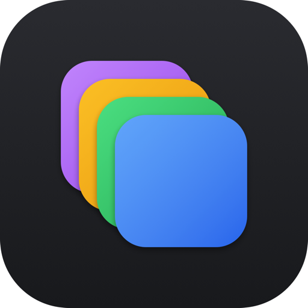
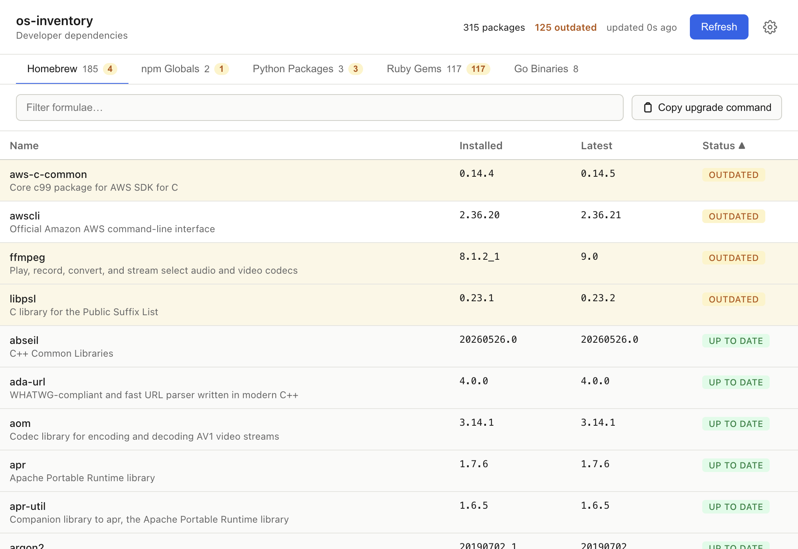
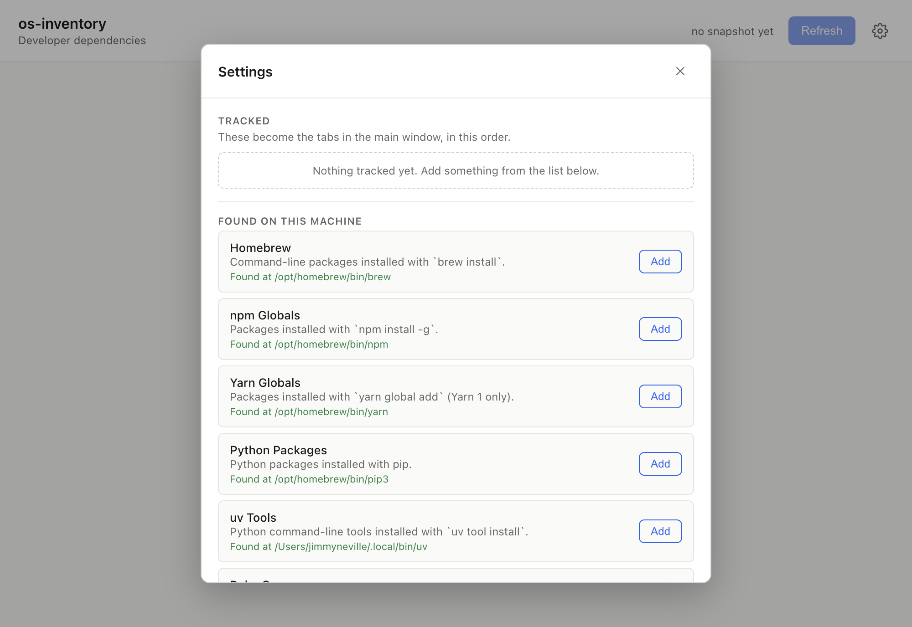

<p align="center">
  
</p>

<h1 align="center">OS Inventory</h1>

A macOS desktop dashboard that shows which of your **developer dependencies are out of date** — what's installed next to the latest available version, at a glance.

Built in support for the package managers most developers already have:

- **Homebrew** — `brew install` formulae
- **JavaScript** — global packages from npm, pnpm, Yarn or Bun
- **Python** — pip packages, plus command-line tools from pipx or uv
- **Ruby** — installed gems
- **Rust** — crates installed with `cargo install`
- **PHP** — Composer global packages
- **Go** — binaries `go install`'d into `$GOBIN`

Nothing is tracked by default. You pick what you want in Settings, and each one becomes a tab. Settings leads with what it actually finds on your machine, so you're never looking at a list of things you don't use.

Using something that isn't on the list? **Add it yourself** — point OS Inventory at any command and tell it how to read the output, either with a pattern or by having your own script print `name`, `installed` and `latest`. There's a Test button that shows you the raw output next to what it parsed.

Built with Electron, React, and TypeScript.



Settings leads with what it actually found on your machine — undetected tools stay collapsed, so you're never shown a list of things you don't use:



## Getting started

```bash
npm install
npm run dev
```

`npm run dev` starts the app with hot module reloading for the renderer. Open **Settings**, add the package managers you care about, then hit **Refresh** — the first run may take a little while (Homebrew's `brew update` alone can take 10–30 seconds), after which a snapshot is cached to disk and repainted instantly on next launch.

## Commands

| Command             | What it does                                                                     |
| -------------------- | --------------------------------------------------------------------------------- |
| `npm run dev`        | Starts main + renderer with HMR and opens the app window.                        |
| `npm run build`      | Full typecheck + production bundle (`out/`). No packaging.                       |
| `npm run build:mac`  | Builds and packages a `.dmg`/`.zip` for macOS via `electron-builder`. Locally signed, not notarized. |
| `npm run typecheck`  | `tsc --noEmit` for both the main and renderer TypeScript configs.                 |
| `npm test`           | Vitest, once. `npm run test:watch` to keep it running.                            |
| `npm run lint`       | ESLint via the electron-toolkit config.                                          |
| `npm run format`     | Prettier, applied in place.                                                      |

## How it works

Each source shells out to its native CLI and compares what's installed against the latest available:

- **Homebrew** — `brew update`, then `brew info --json=v2 --installed`, which computes the `outdated` flag per formula.
- **npm / pnpm globals** — the manager's own `ls` merged with its `outdated` report.
- **Yarn / Bun globals** — `yarn global list` cross-checked against the npm registry; `bun outdated --global`.
- **Python** — `pip list --outdated --format=json`, which reports installed and latest together. `pipx list --json` and `uv tool list` name only what's installed, so their latest versions come from PyPI.
- **Ruby** — `gem outdated`.
- **Rust** — `cargo install --list`, with the latest stable version of each crate resolved in batch via the crates.io API.
- **PHP** — `composer global outdated --format=json`.
- **Go binaries** — `go version -m` over everything in `$GOBIN`, with the latest version resolved per module via the Go module proxy (`proxy.golang.org`).

Sources run concurrently and fail independently: a missing CLI or a dead network marks that one tab and leaves the rest intact. CLI locations are detected rather than hard-coded, and every one can be overridden in Settings.

Results are cached to `~/Library/Application Support/os-inventory/snapshot.json` and repainted immediately on launch, so there's no blank screen while checks run.

See [`CLAUDE.md`](./CLAUDE.md) for the architecture, IPC contract, and per-source implementation notes.

## Scope

**Package managers that install developer dependencies.** That's the whole remit.

Deliberately not covered: applications and their plugins (editor extensions), and OS software (system updates, Mac App Store, `/Applications`, Homebrew casks). Keeping to one category is what stops the built-in list from being an opinion about which tools you ought to be using — and anything outside it, you can still add as a custom source.

## Requirements

- macOS. Paths resolve per-platform and Linux/Windows are prepared for, but only macOS is tested.
- Every source is optional. Track only what you use; undetected tools stay out of your way.

## Known limitations

- Not distributable yet — `electron-builder` signs with whatever identity it finds in the local keychain, but an Apple Development certificate isn't a Developer ID, and notarization is off (`notarize: false`). `spctl` rejects the result, so it runs on the machine that built it and Gatekeeper blocks it anywhere else. Shipping needs a Developer ID Application certificate and notarization enabled.
- No auto-update of the app itself.

## License

[MIT](./LICENSE)
